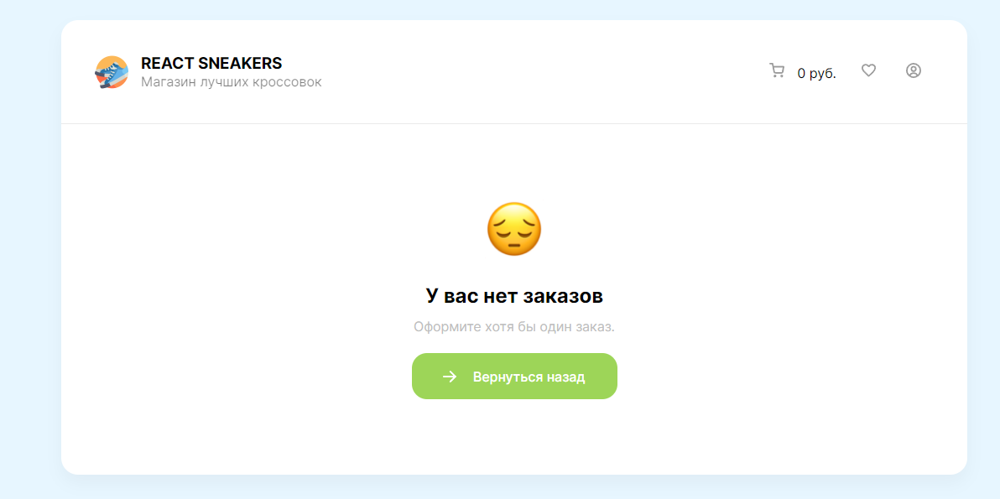

<h1 align="center">Выполнение React Sneakers от Archakov Blog</h1>

    

<a name="summary">
  

    
Оглавление

    <ol>
      <li><a href="#project-description">Описание проекта</a></li>
      <li><a href="#technologies">Стек технологий</a></li>
      <li><a href="#installation">Установка и запуск приложения в локальном репозитории</a></li>
      <li><a href="#functionality">Функционал</a></li>
      <li><a href="#enhancement">Что можно улучшить</a></li>
    </ol>
  

</a>

<a name="project-description"><h2>О проекте</h2></a>
Проект, выполненный по видео-урокам <a href="https://www.youtube.com/@ArchakovBlog">&laquo;Archakov Blog&raquo;</a>. Работа выполнялась в качестве практики. Проект представляет собой онлайн-магазин с возможностью добавлять товар в корзину и в закладки, а так же просматривать товары в личном кабинете. 

<b>Ссылки на проект:</b>
 
Деплой: <i><a href="https://regina-alt.github.io/react-sneakers-regina/">&laquo;Демо&raquo;</a></i>
 
Видео-уроки от: <a href="https://www.youtube.com/@ArchakovBlog">&laquo;Archakov Blog&raquo;</a>
 

<b>Фото проекта:</b>
 

<a name="technologies"><h2>Стек технологий</h2></a>

	<code></code>
	<code></code>
	<code></code>
	<code></code>

<a name="installation"><h2>Установка и запуск</h2></a>
1. `git clone` - клонировать репозиторий на свое устройство (HTTPS)
2. `npm i` - установить зависимости
3. `npm start` - запустить приложение

<a name="functionality"><h2>Функционал</h2></a>
- Добавление/удаление товаров в корзину
- Поиск товара по названию
- Добавление/удаление товаров из закладок
- Просмотр товаров в личном кабинете

<a name="enhancement"><h2>Что можно улучшить</h2></a>
- Адаптивность сайта
- Просмотр товаров, добавленных в закладки, на главной странице
